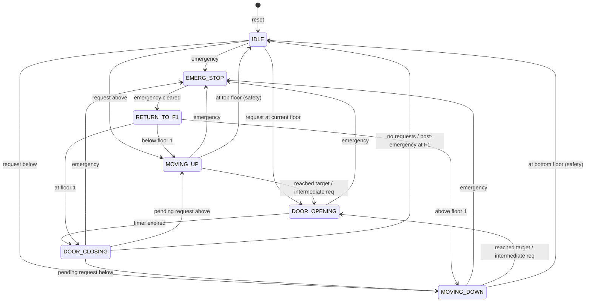

# 🛗 Multi-Floor Elevator Controller

> **FPGA-synthesizable, FSM-based elevator controller** for a 5-floor building with floor-2 priority servicing, emergency handling, and automatic return-to-floor-1 logic — written in fully synthesizable Verilog.

[](LICENSE)


---

## 📋 Table of Contents

- [Overview](#overview)
- [Features](#features)
- [Architecture](#architecture)
- [Module Descriptions](#module-descriptions)
- [FSM State Diagram](#fsm-state-diagram)
- [Port Descriptions](#port-descriptions)
- [Parameters](#parameters)
- [Getting Started](#getting-started)
  - [Prerequisites](#prerequisites)
  - [Simulation](#simulation)
  - [FPGA Synthesis](#fpga-synthesis)
- [Testbench](#testbench)
- [Design Decisions](#design-decisions)
- [Directory Structure](#directory-structure)
- [License](#license)

---

## Overview

This project implements a **Multi-Floor Elevator Controller** targeting FPGA platforms (tested on the Nexys 4 / Artix-7). The controller manages elevator movement across **5 floors (0–4)**, accepts push-button floor requests, and features:

- **Floor 2 priority** — requests for floor 2 are always serviced before other pending requests.
- **Emergency stop** — immediately opens doors and, once cleared, returns the elevator to floor 1 before resuming normal operation.
- **Button debouncing** — a two-stage synchronizer with rising-edge detection prevents glitches from mechanical switches.
- **Intermediate floor servicing** — the elevator stops at floors along its path if they have pending requests, improving efficiency.

The design follows a **clean three-module architecture** separating concerns between input conditioning, FSM logic, and top-level integration.

---

## Features

| Feature | Description |
|---|---|
| **5-Floor Operation** | Supports floors 0 through 4 with full up/down traversal |
| **Floor 2 Priority** | Floor 2 requests are evaluated first in both IDLE and DOOR_CLOSING states |
| **Emergency Mode** | Active-high emergency input opens doors immediately; auto-returns to floor 1 when cleared |
| **Button Debouncing** | Two-stage synchronizer + rising-edge detector eliminates switch bounce |
| **Door Timing** | Configurable open/close durations via parameters (default ~0.1 s at 100 MHz) |
| **Intermediate Servicing** | Stops at floors along the travel path that have active requests |
| **Nearest-Floor Targeting** | Finds the nearest requested floor (not farthest) for efficient travel |
| **Request Freezing** | Floor requests are frozen during EMERGENCY and RETURN_TO_F1 states |
| **Fully Synthesizable** | No `initial` blocks in RTL; parameterized and portable |

---

## Module Descriptions

### `button_debouncer` — *Input Conditioning*

| Parameter | Default | Description |
|---|---|---|
| `NUM_BUTTONS` | 5 | Number of button inputs |

- **Two-stage synchronizer** (`sync_0` → `sync_1`) mitigates metastability from asynchronous button inputs.
- **Rising-edge detector** compares current synchronized value with the previous sample to produce a **single-cycle pulse** per press.

### `elevator_controller` — *Core FSM & Logic*

| Parameter | Default | Description |
|---|---|---|
| `NUM_FLOORS` | 5 | Number of floors |
| `DOOR_OPEN_TIME` | 10,000,000 | Door-open duration in clock cycles (~0.1 s @ 100 MHz) |
| `DOOR_CLOSE_TIME` | 10,000,000 | Door-close duration in clock cycles (~0.1 s @ 100 MHz) |

Contains:
- **7-state FSM** (IDLE, MOVING_UP, MOVING_DOWN, DOOR_OPENING, DOOR_CLOSING, EMERG_STOP, RETURN_TO_F1)
- **Request register** — latches debounced pulses, clears on service, freezes during emergency
- **Target-floor selection** — nearest-first algorithm with floor-2 priority override
- **Door timer** — 24-bit counter for configurable open/close durations
- **Post-emergency return** — flag-driven return-to-floor-1 sequence

### `elevator_top` — *Top-Level Wrapper*

Instantiates the debouncer and controller, passing parameters through. Port interface matches the original monolithic design for drop-in compatibility.

---

## FSM State Diagram



---

## Port Descriptions

### Top-Level Ports (`elevator_top`)

| Port | Width | Direction | Description |
|---|---|---|---|
| `clk` | 1 | Input | System clock (100 MHz) |
| `reset` | 1 | Input | Asynchronous active-high reset |
| `emergency` | 1 | Input | Emergency switch (active high) |
| `btn` | 5 | Input | Raw push-button inputs for floors 0–4 |
| `current_floor` | 3 | Output | Current floor position (0–4) |
| `door` | 1 | Output | Door status: `1` = open, `0` = closed |
| `floor_req` | 5 | Output | Active floor request register (for debugging) |
| `direction` | 1 | Output | Travel direction: `1` = up, `0` = down |
| `priority` | 1 | Output | `1` when floor 2 has an active request |

---

## Parameters

| Parameter | Default | Description |
|---|---|---|
| `DOOR_OPEN_TIME` | `24'd10_000_000` | Number of clock cycles the door stays open (~0.1 s at 100 MHz) |
| `DOOR_CLOSE_TIME` | `24'd10_000_000` | Number of clock cycles the door stays closed during closing sequence |

> **Tip:** For simulation, override these to small values (e.g. `24'd10`) to reduce simulation time dramatically.

---

## Getting Started

### Prerequisites

- **Simulation:** [Icarus Verilog](http://iverilog.icarus.com/) + [GTKWave](http://gtkwave.sourceforge.net/), or Xilinx Vivado Simulator, or ModelSim
- **Synthesis:** Xilinx Vivado (targeting Artix-7 / Nexys 4) or any compatible FPGA toolchain

### Simulation

#### Using Icarus Verilog

```bash
# Compile all sources + testbench
iverilog -o elevator_sim \
    src/button_debouncer.v \
    src/elevator_controller.v \
    src/elevator_top.v \
    tb/elevator_tb.v

# Run simulation
vvp elevator_sim

# View waveforms
gtkwave elevator_tb.vcd &
```

#### Using Xilinx Vivado

1. Create a new RTL project targeting your FPGA.
2. Add `src/*.v` as design sources.
3. Add `tb/elevator_tb.v` as a simulation source.
4. Run **Behavioral Simulation** from the Flow Navigator.

### FPGA Synthesis

1. Add all files from `src/` as design sources in Vivado.
2. Set `elevator_top` as the **top module**.
3. Create or import an **XDC constraints file** mapping:
   - `clk` → 100 MHz oscillator
   - `reset` → a push button
   - `emergency` → a switch
   - `btn[4:0]` → five push buttons
   - `current_floor`, `door`, `direction`, `priority` → LEDs
   - `floor_req` → LEDs (debug)
4. Run **Synthesis → Implementation → Generate Bitstream**.
5. Program the FPGA.

---

## Testbench

The testbench (`tb/elevator_tb.v`) provides **11 comprehensive test cases** with self-checking assertions:

| Test | Description |
|---|---|
| **Test 1** | Single floor request — go from F0 to F4 |
| **Test 2** | Priority — request F0, F2, F3 simultaneously; F2 served first |
| **Test 3** | Emergency triggered mid-travel; verify return to F1 |
| **Test 4** | Repeated floor 2 presses (debounce robustness) |
| **Test 5** | Idle state — no pending requests |
| **Test 6** | Sequential requests: F0 → F1 → F2 → F4 |
| **Test 7** | Request for the current floor (instant door open) |
| **Test 8** | Multiple simultaneous requests |
| **Test 9** | Emergency while idle |
| **Test 10** | Intermediate floor servicing during travel |
| **Test 11** | Boundary: request F0 while already at F0 |

### Testbench Features

- **Parameterized door timers** — overridden to 10 cycles for fast simulation
- **Pass/Fail reporting** — automated checks with summary at end
- **VCD waveform dump** — generates `elevator_tb.vcd` for waveform viewing
- **Cycle-by-cycle monitor** — logs FSM state, floor, requests, and door status

---

## Design Decisions

| Decision | Rationale |
|---|---|
| **Nearest-floor targeting** | Original code found the *farthest* floor; changed to *nearest* for realistic elevator behavior |
| **Intermediate floor stops** | Elevator now checks `floor_req[next_floor]` during MOVING states and stops if a request exists |
| **Combined latch + clear** | During DOOR_OPENING, new button presses are OR'd with existing requests *before* clearing the current floor, preventing lost requests |
| **Boundary guards** | MOVING_UP/DOWN states guard against `current_floor + 1 > 4` and `current_floor - 1 < 0` to prevent out-of-range array access |
| **Modular split** | Separating debounce from FSM improves testability and allows reuse of the debouncer in other projects |

---

## License

This project is licensed under the **MIT License** — see the [LICENSE](LICENSE) file for details.

---

<p align="center">
  <i>Designed for educational and FPGA prototyping purposes.</i><br>
  <b>⭐ Star this repo if you find it helpful!</b>
</p>
